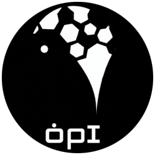
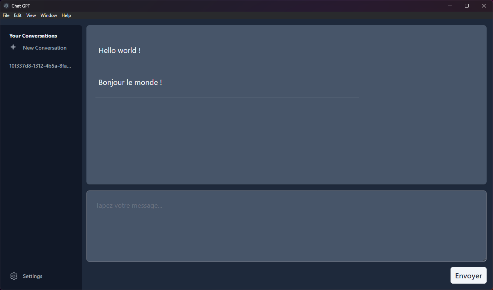

# electron-gpt

This repository is a clone of the [electron/electron-quick-start](https://github.com/electron/electron-quick-start) repository.

The project is a simplified chatbot using OpenAI's GPT (Generative Pre-trained Transformer) model.

<p align="center">
  
</p>

<p align="center">
  
</p>

## Getting Started

To get started with this project, clone this repository and follow the steps below.

### Prerequisites

- [Node.js](https://nodejs.org/en/)
- [npm](https://www.npmjs.com/get-npm)

### Installation

1. Clone this repository:

```
git clone https://github.com/Bubuclem/electron-gpt.git 
```

2. Install the dependencies:

```
cd electron-gpt
npm install 
```

3. Set OPENAI_API_KEY=sk-XXXXXX in your environment variables.

### Usage

1. Start the application:

```
electron-forge start
```

2. Type in a message and press enter to send it to the chatbot.

The chatbot will respond with a generated message based on the GPT model.
